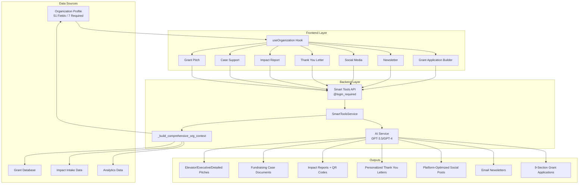

# Pink Lemonade Smart Tools Architecture & Data Flow

## System Overview



## Detailed Flow for Each Smart Tool

### 1. Grant Pitch Generator
**Route:** `/grant-pitch`  
**API:** `/api/smart-tools/pitch/generate`

```
USER FLOW:
1. User navigates to Grant Pitch tool
2. useOrganization hook loads profile data
3. Auto-fills:
   - Alignment ← organization.mission
   - Funding Need ← organization.focus_areas
4. User selects pitch type (elevator/executive/detailed)
5. User clicks "Generate"

BACKEND FLOW:
1. API validates authentication
2. Retrieves organization by user.org_id
3. SmartToolsService.generate_grant_pitch() called
4. Builds comprehensive org context:
   - Organization details (name, mission, focus areas)
   - Grant performance metrics
   - Previous funders
   - Impact stories
5. AI generates pitch based on type
6. Returns formatted pitch content

OUTPUT:
- Elevator Pitch: 30-second verbal pitch
- Executive Pitch: 2-3 paragraph summary
- Detailed Pitch: Full page comprehensive pitch
```

### 2. Case for Support Builder
**Route:** `/case-support`  
**API:** `/api/smart-tools/case/generate`

```
USER FLOW:
1. User navigates to Case Support tool
2. useOrganization hook loads profile data
3. Auto-fills:
   - Campaign Purpose ← organization.mission
   - Campaign Goal ← 20% of annual_budget_range midpoint
   - Target Donors ← focus_areas + demographics + location
4. User adjusts campaign details
5. User clicks "Generate"

BACKEND FLOW:
1. API validates authentication
2. Retrieves organization
3. SmartToolsService.generate_case_for_support() called
4. Builds org context with emphasis on:
   - Funding history
   - Impact metrics
   - Program descriptions
5. AI generates comprehensive case document
6. Returns structured case for support

OUTPUT:
- Multi-section fundraising document
- Includes: need statement, solution, impact, call to action
- Professional formatting
```

### 3. Impact Report Creator
**Route:** `/impact-report`  
**API:** `/api/smart-tools/impact/generate`

```
USER FLOW:
1. User navigates to Impact Report tool
2. useOrganization hook loads profile data
3. Auto-fills:
   - Reporting Period
   - Beneficiary data ← demographics_served
4. Shows participant feedback QR code option
5. User clicks "Generate Report"

BACKEND FLOW:
1. API validates authentication
2. Retrieves organization + impact intake data
3. SmartToolsService.generate_impact_report() called
4. Aggregates:
   - Participant stories from ImpactIntake table
   - Grant outcomes
   - Analytics metrics
5. AI generates comprehensive impact narrative
6. Generates QR code for feedback collection
7. Returns formatted report

OUTPUT:
- Executive summary
- Program outcomes
- Participant testimonials
- Data visualizations description
- QR code for participant feedback
```

### 4. Thank You Letter Writer
**Route:** `/thank-you-letter`  
**API:** `/api/smart-tools/thank-you/generate`

```
USER FLOW:
1. User navigates to Thank You Letter tool
2. useOrganization hook loads profile data
3. Auto-fills:
   - Donation Purpose ← organization.primary_focus_areas
   - Donation Amount ← 0.5% of annual_budget midpoint
4. User enters donor details
5. User clicks "Generate"

BACKEND FLOW:
1. API validates authentication
2. Retrieves organization
3. SmartToolsService.generate_thank_you_letter() called
4. Builds context with:
   - Recent impact stories
   - Organization achievements
5. AI generates personalized letter
6. Returns formatted thank you letter

OUTPUT:
- Personalized donor letter
- Includes impact acknowledgment
- Professional formatting
- Ready to send
```

### 5. Social Media Creator
**Route:** `/social-media`  
**API:** `/api/smart-tools/social/generate`

```
USER FLOW:
1. User navigates to Social Media tool
2. useOrganization hook loads profile data
3. Auto-fills:
   - Topic ← organization.mission
   - Hashtags ← #[focus_areas] #[location] #NonProfit
4. User selects platform (Twitter/Facebook/Instagram/LinkedIn)
5. User clicks "Generate"

BACKEND FLOW:
1. API validates authentication
2. Retrieves organization
3. SmartToolsService.generate_social_media_post() called
4. Platform-specific optimization:
   - Character limits
   - Hashtag counts
   - Tone adjustments
5. AI generates platform-optimized content
6. Returns post with metadata

OUTPUT:
- Platform-optimized post text
- Character count
- Recommended hashtags
- Best time to post
- Engagement tips
```

### 6. Newsletter Generator
**Route:** `/newsletter`  
**API:** `/api/smart-tools/newsletter/generate`

```
USER FLOW:
1. User navigates to Newsletter tool
2. useOrganization hook loads profile data
3. Auto-fills:
   - Theme ← based on recent grants/activities
   - Focus Area ← organization.primary_focus_areas
4. User specifies month/year and audience
5. User clicks "Generate"

BACKEND FLOW:
1. API validates authentication
2. Retrieves organization + recent activities
3. SmartToolsService.generate_newsletter_content() called
4. Aggregates:
   - Recent grant updates
   - Impact stories
   - Upcoming events
5. AI generates multi-section newsletter
6. Returns formatted newsletter

OUTPUT:
- Header with organization branding
- Executive message
- Program updates
- Impact stories
- Call to action
- Footer with contact info
```

### 7. Grant Application Builder
**Route:** `/grant-application`  
**API:** `/api/smart-tools/application/generate`

```
USER FLOW:
1. User navigates to Grant Application Builder
2. useOrganization hook loads profile data
3. Auto-fills Organization Background section:
   - Name, mission, type, focus areas
   - Service area, budget, staff size
   - History, programs, impact
4. User enters grant details (optional)
5. User can generate individual sections or all at once
6. Progress bar shows completion status

BACKEND FLOW:
1. API validates authentication
2. Retrieves organization
3. SmartToolsService.generate_application_section() called
4. For each section:
   - Builds section-specific context
   - Includes existing sections for coherence
   - AI generates targeted content
5. Returns section content

OUTPUT (9 Sections):
1. Executive Summary
2. Organization Background (auto-filled)
3. Need Statement / Problem Description
4. Project Description / Approach
5. Goals & Objectives
6. Evaluation Plan
7. Budget Narrative
8. Sustainability Plan
9. Appendix / Supporting Materials
```

## Data Flow Summary

### Input Sources
- **Organization Profile:** 51 fields (7 required)
  - name, mission, org_type, primary_focus_areas
  - service_area_type, annual_budget_range, staff_size
  - Plus 44 optional fields for comprehensive context

- **Grant Database:** Historical grant data
  - Previous applications, wins, amounts
  - Funder relationships

- **Impact Data:** Participant feedback
  - Stories, testimonials, outcomes
  - Collected via ImpactIntake system

- **Analytics:** Performance metrics
  - Success rates, funding totals
  - Program effectiveness

### Processing Layer
1. **Authentication:** All tools require user login
2. **Organization Resolution:** Links user → organization
3. **Context Building:** Aggregates all relevant data
4. **AI Generation:** GPT-3.5 for simple, GPT-4 for complex
5. **Response Formatting:** Tool-specific output structure

### Output Formats
- **Text Documents:** Grant applications, letters, reports
- **Social Content:** Platform-optimized posts
- **Interactive:** QR codes for feedback collection
- **Templates:** Save and reuse generated content
- **Downloads:** Export as text files

## Verification Status
✅ All 7 Smart Tools API endpoints operational
✅ Authentication working correctly
✅ Organization data retrieval functional
✅ AI service integration active
✅ Frontend routes configured
✅ Auto-filling implemented across all tools

## Architecture Benefits
1. **Consistent Data Flow:** All tools use same organization context
2. **Reduced Manual Entry:** Auto-filling from profile
3. **AI Optimization:** Smart model selection based on complexity
4. **Security:** Login required, org-scoped data access
5. **Scalability:** Modular design allows easy tool addition